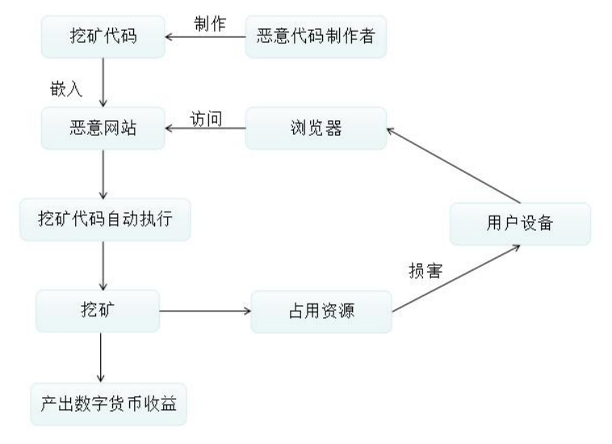
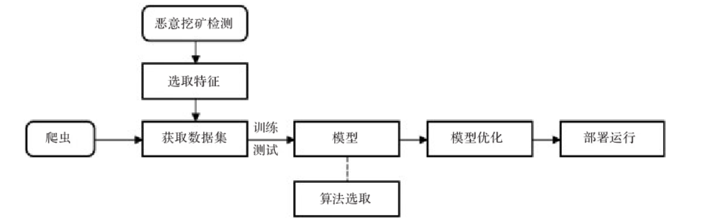

## 恶意挖矿脚本功能文档

## 需求文档
#### 一、目标与背景
数字加密货币所蕴含的生产力是计算资源和电力资源。对于挖矿者来说，计算资源就等于收益，所以在寻求廉价的算力资源和电力资源驱动下，部分恶意挖矿者选择开发挖矿木马、挖矿软件等，它们的运行需要经过安全软件的检测，比如特征码匹配的方式检测。所以出现一种更隐蔽的方法是在网页中内嵌挖矿脚本，只要用户访问恶意网站，就有被挖矿的风险。

基于浏览器的挖矿恶意代码攻击流程如下：



网页挖矿的行为主要基于 JavaScript，禁用 JavaScript 服务可以防止
网页挖矿，同时也会对浏览器服务可用性造成影响。所以我们想构建一个基于浏览器的，以静态分析为主要特征作为检测方法的挖矿病毒检测功能模块，作为信创卫士一方面的功能，帮助用户更好地判断和含有非法禁用挖矿脚本的网页。

#### 二、功能和技术需求
通过知网搜索，我们发现一篇近年的相关文献[1]有对恶意挖矿脚本进行一定的分析，我们根据文献和自己的思路建立流程参考如下：
 

为了实现静态分析，该模块需要实现的基本功能是：爬取用户提供的URL中的源码、建立特征分析、建立模型判断网页链接中是否含有恶意挖矿脚本、根据最新信息更新特征分析功能。

而技术需求，经过讨论，我们考虑使用`python`作为编程语言，因为其对于爬虫和模型训练的实现已经有相当丰富的库函数。


#### 三、输入输出

静态分析功能：
输入：用户输入一个网页链接/网页源码
输出：页面爬取成功，返回判断概率包含恶意网页链接，并给出判断依据
页面爬取失败，返回提示，使得用户检测自身网络情况或选择源码方式判断

更新特征分析功能：
输入：包含最新的恶意脚本网站词库图片
输出：如果打开图片成功，返回OCR识别结果

#### 四、可行性分析

技术上，由于大创接触过APP爬虫使用的`appium`，对于爬虫的编写有一定的基础，所以基本认为这是一个可以做的功能。精度和准确性上，由于已经有一定的论文支撑，我们认为实现的效果也应该能符合预期。法律道德的角度上，对页面简单的爬取并不会给一个服务器造成大量的访问流量，并且所实现的效果能保护用户的权益，我们认为这是利大于弊的。


## 设计开发文档

### 后端开发

#### First Task

*行者常至，为者长成。*我们从小到大慢慢实现一些基础功能给予自己继续开发勇气。

首先是第一个简单的特征分析，资料说明*研究比较钓鱼 URL 和良性 URL 发现，一些恶意的 URL 具有相似的伪装策略。对 URL 的长度和词袋进行分析，对 URL 进行分词，判断分词在自然语言中出现频率，可以作为判别钓鱼网站的特征。*

目前实现的是: 1.获取URL长度，2.分词获取URL协议，判断其是否是http
后续开发点：构建大语料库
（我们尝试添加URL分词进词袋，但是由于可用的词料太少，根本无法构成一个有效的自然语料库，所以做罢了）

##### Second Task
制作URL爬虫，爬取页面的js文件
方案一：静态爬取，失败

```python
url = "https://www.baidu.com/"
response = requests.get(url)
html = response.text

soup = BeautifulSoup(html, "html.parser")

script_tags = soup.find_all("script")

for script_tag in script_tags:
    js_code = script_tag.string
    if js_code:
        print(js_code)
```
这是我们第一个静态爬取方案，根据静态response进行script脚本提取，但是查资料后发现这样可能不包含通过JavaScript动态生成的内容，只能获取到服务器返回的静态内容。


方案二：基于Selenium模拟动态爬取
```python
    driver = webdriver.Chrome()
    driver.get(url)
    html = driver.page_source
```

对于大部分情况爬取是很顺利，对比页面源码也比较一致，但是我们发现有两种情况使用爬虫无法爬取到页面源码(大概占5%的页面)，一是网络链接不好时，页面响应时间过长，为了保证效率我们设置过期时间为10s。二是页面元素过多，有一些恶意页面是实时动态改变跳转的，爬虫没有办法获取全部页面元素从而卡死。对于这两种情况，我们目前的做法是建议用户检查网络链接，或者在虚拟环境中手动爬取页面源码提交给我们。

后续开发点：1.目前使用的爬虫是针对于Chrome浏览器的，后续可以列出常用的浏览器(如Firefox/Safari)为用户提供选择。
2.在页面中提供一个沙箱等其它虚拟环境，可以供用户访问可疑网页。

#### Third Task
页面特征分析，根据参考论文说明:

1.*可以发现同属于一个提供商的脚本具有相似的代码关键
字。因此可以通过正则表达式匹配网页代码段中是否含有该关键字，来进行识别判断*

关键词匹配：在网上我们找到了一份插件用于过滤主流矿战提供商的关键词过滤txt。

https://github.com/xd4rker/MinerBlock/blob/master/assets/filters.txt

其中用了类似于正则匹配的搜索方式，但是在我们用自动化改写成正则表达式对html进行搜索时，
```python
escaped_expression = re.escape(text)
# 将通配符 * 替换为正则表达式的 .*
regex_patterns = escaped_expression.replace(r'\*', r'.*')
regex_patterns = regex_patterns.splitlines()

def check_html_matching(file_path, regex_patterns):
    with open(file_path, "r", encoding="utf-8") as file:
        html_text = file.read()

    for pattern in regex_patterns:
        if re.search(pattern, html_text):
            print(pattern)
            return True
    return False
    pattern = r'.*://.*coinhive\.com/lib.*'
    if re.search(pattern, html_text):
    #         print(pattern)
        return True
    return False

html_file_path = "GoodURL\importanteg.html"

is_matching = check_html_matching(html_file_path, regex_patterns)
print(is_matching)
```
发现对于大型html文件匹配时，使用正则表达式会出现花费大量时间的情况，通过观察恶意文本，我们发现没有必要使用正则表达式进行匹配，直接使用关键词匹配即可。

```python
matches = re.findall(r"[^*:\/\n]+", text, flags=re.DOTALL)
```
然而发现过滤文本中会出现太多杂词导致失败，所以最后使用最简单的首尾字母提取过滤文本中的关键词，并对html进行搜索，并测试通过。

接着是*计算函数：除 SHA-256 算法外，CryptoNight算法也常用来实现共识。此外，进行挖矿需要下载有效载荷，一般是wasm模块。结合以上两个特点，本文选取“Cryptonight、SHA256、hash、wasmwrapper、Web Assembly、scrypt”这 6 个关键字用以匹配函数名称来标识有无出现上述特点的函数。* 

*动态函数：本文通过统计setTimeout（）、setInterval（）函数的个数来识别挖矿网站。*

以及我们发现的cpu限制率关键词*throttle*，针对以上的关键词，我们做了提取并作为一个URL的特征。

#### Fourth Task
建立模型：先是爬取数据集，我们通过关键词匹配在publicwww.com中进行搜索爬取，通过爬虫登录publicwww.com并爬取出rank前3M含有关键词恶意脚本的网页。

在登录环节一开始根据一些安全课程的经验，选取的是cookie方式，但是经典的还是失败了，后续就选择最朴素的元素登录方式。
```python
cookie_dict = {...
'PHPSESSID': 'dnoscmp49b20cue4b41q5p4hpa'}

driver.add_cookie(cookie_dict)
# 刷新使cookie生效
driver.refresh()
```

并根据之前的策略制作出数据集用于模型训练和测试。

#### Fifth Task

用户需要更新关键词，但就我们自己阅读论文的体验，论文中是一个关键词是以图片形式呈现的，我们手打关键词进入输入框显得非常耗时，所以我们想到了OCR，图像文字识别，根据网上开源的OCR框架，https://github.com/tesseract-ocr/tesseract，我们调用其python接口完成了这一功能。

综上，后端部分的开发告一段落。

### 结合前端开发

#### Task 1
最简单的任务，就是将后端的功能部署到前端。

根据前端同学使用的Streamlit教程，我先搭了一个简单的页面前端，分为四个模块。
```python
with function_tab:
with settings_tab:
with file_upload_tab:
with model_update:
```
然后通过类似的函数调用后端的接口:
```python
on_click=API.call_scan, args=[URL_search, option]
```
这样基本就完成了最基本的后端功能接口。