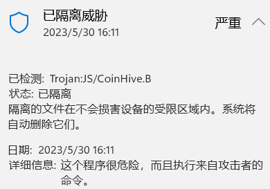

# Miner_model
Use for antivirus

filter.txt comes from https://github.com/xd4rker/MinerBlock/blob/master/assets/filters.txt

The whole framework refer to the passage: Outguard: Detecting In-Browser Covert Cryptocurrency Mining in the Wild

### Important things:

Please pull or push the html in BadURL and BadTest in .rar format. if you unzip it and try to `git add .`, you will find:
  

To protect your computer resource, you should be careful about it!
