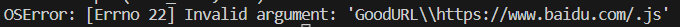

*行者常至，为者长成。*
*面对恐惧最好的方法就是战胜它！*

#### First Task
URL 匹配：研究比较钓鱼 URL 和良性 URL 发现，一些恶意的 URL 具有相似的伪装策略。对 URL 的长度和词袋进行分析，对 URL 进行分词，判断分词在自然语言中出现频率，可以作为判别钓鱼网站的特征。

目前实现的是: 1.获取URL长度，2.分词获取URL协议，判断是否是http
尚未完成可以添加：构建语料库

#### Second Task
制作URL爬虫，爬取页面的js文件
方案一：静态爬取，失败

```python
# # 发起请求获取网页内容
# url = "https://www.baidu.com/"
# response = requests.get(url)
# html = response.text

# # 使用BeautifulSoup解析网页内容
# soup = BeautifulSoup(html, "html.parser")

# # 找到网页中的所有<script>标签
# script_tags = soup.find_all("script")

# # 提取每个<script>标签中的 JavaScript 代码
# for script_tag in script_tags:
#     js_code = script_tag.string
#     if js_code:
#         # 处理 JavaScript 代码，可以根据需要进行分析或保存
#         print(js_code)
```

```python
# 创建浏览器对象
driver = webdriver.Chrome()

# 打开网页
driver.get(url)

# 获取网页中的完整JavaScript代码
# js_code = driver.execute_script("return document.documentElement.outerHTML")

html = driver.page_source
# 使用 BeautifulSoup 解析网页内容
soup = BeautifulSoup(html, "html.parser")

# 找到所有 <script> 标签
script_tags = soup.find_all("script")

# 创建目录
directory = 'GoodURL'
if not os.path.exists(directory):
    os.makedirs(directory)

# 创建以URL为名称的文件
file_name = os.path.join(directory, hashlib.md5(url.encode()).hexdigest() + ".html")

with open(file_name, "w", encoding='utf-8') as file:
            file.write(html)

# 提取每个 <script> 标签中的 JavaScript 代码(提取不完全)
# for script_tag in script_tags:
#     # 获取script中的string
#     # js_code = script_tag.string
#     # if js_code:
#     print(script_tag)
#     with open(file_name, "a", encoding='utf-8') as file:
#         file.write(str(script_tag))

# 关闭浏览器
driver.quit()
```

方案二：动态爬取
命名：
  


#### Third Task
关键词匹配：对于大量html文件匹配时，使用正则表达式会出现花费大量时间的情况，通过观察恶意文本，我们发现没有必要使用正则表达式进行匹配，直接使用String字符匹配即可。

```python
# 将特殊字符进行转义
escaped_expression = re.escape(text)

# 将通配符 * 替换为正则表达式的 .*
regex_patterns = escaped_expression.replace(r'\*', r'.*')

print(regex_patterns)

regex_patterns = regex_patterns.splitlines()

def check_html_matching(file_path, regex_patterns):
    with open(file_path, "r", encoding="utf-8") as file:
        html_text = file.read()

    for pattern in regex_patterns:
        if re.search(pattern, html_text):
            print(pattern)
            return True
    return False
    pattern = r'.*://.*coinhive\.com/lib.*'
    if re.search(pattern, html_text):
    #         print(pattern)
        return True
    return False

html_file_path = "GoodURL\importanteg.html"

is_matching = check_html_matching(html_file_path, regex_patterns)
print(is_matching)
```

```python
matches = re.findall(r"[^*:\/\n]+", text, flags=re.DOTALL)
```

关键词匹配有太多的杂词很容易失败，使用最简单的判断首尾字母判别法。

#### Fourth Task
爬取数据集，静态还是失败了...
```python
import requests
from bs4 import BeautifulSoup

# 要搜索的关键词
keyword = 'coinhive.com/lib'

# 构造搜索URL
search_url = f'https://publicwww.com/websites/"{keyword}"'

# 发起GET请求
response = requests.get(search_url)

# 解析HTML内容
soup = BeautifulSoup(response.text, 'html.parser')


# 找到所有链接元素
link_elements = soup.find_all('a')

# 遍历每个链接元素并打印URL
for link_element in link_elements:
    url = link_element.get('href')
    print(url)
```

动态爬取数据集成功，使用`selenium`自动登录获取更多的页面URL。

明天开始做数据集！